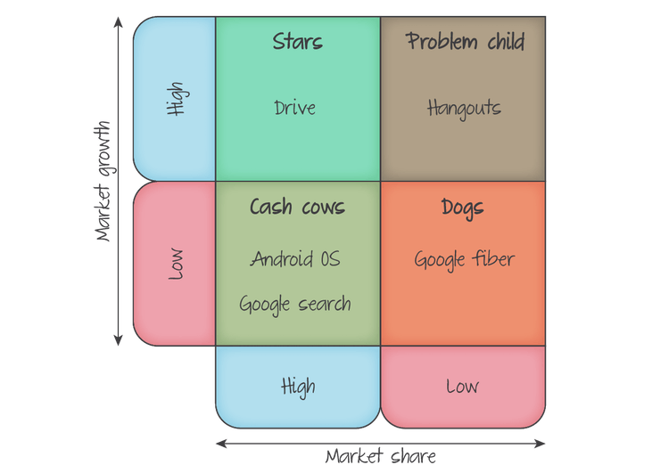
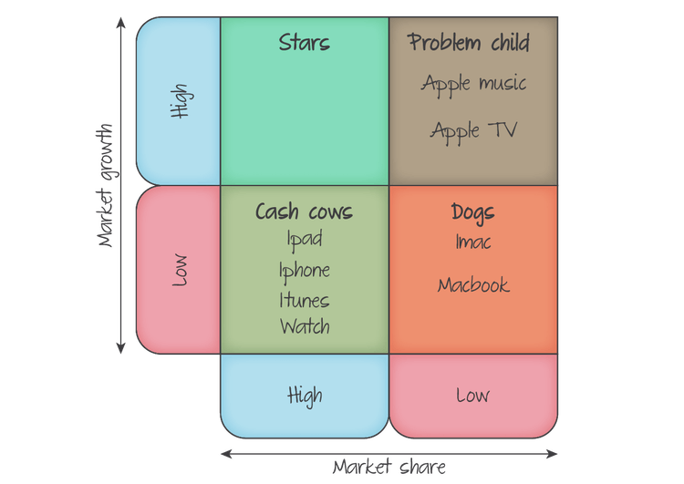
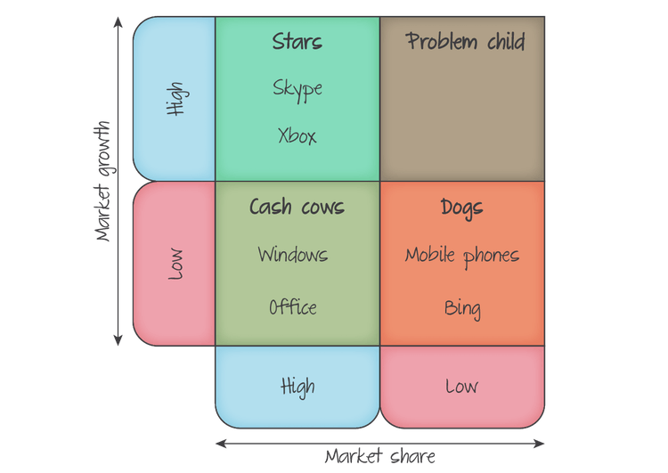

# Product in the marketing mix
  

### BCG

-matrix.cf0712024fc14d01a403.png)

 
Boston Consulting Group BCG matrix

help companies with multiple products decide their strategy

reminder to firms to build a portfolio of products to rely on for growth

 - Cash Cow
	 - bring in revenue into the company
 - Stars
	 - get growth in sales
 - dogs
	 - soon dispensed with or use new strategies for the product
 - problem child

Products can go through all of these stages, stating off as successful in some respects but not others and later becoming a star and selling strongly with good growth and eventually dwindle until a new sale strategy needs to be developed

 
###  Market Share
Percentage of total market sales controlled by a particular product

>  **Market Share = Product Sales / Total market sales**

> e.x. company sells 200 mill worth of goods each year, it manages to discover 1000 mullion worth of goods in the entire year
>
> **200m/1000m = 20%**

higher market share have higher chance of having better ecenomics of scale and wider distribution

 

### Market Growth

*How fast the total demand for a product is expanding or contracting within one year*

> (Total Market Sales this year - Total Market ) / Total Market Sales Last Year

>e.x. clothing brand sold 950 mill worth of clothing and 1000Mill the next year
> 
> Market Growth = (1000 - 950) / 950
> **Market Growth = 5.26%**

This can be related to product life cycle. Products in maturity and decline have low market growth while growing products have higher market growth

## Product Classifications
  
### Cash Cows (high market share, low market growth)

Cash cows are successful products in mature markets. They enjoy high sales revenue from an established customer base. Customer loyalty is likely high. Therefore less money is need for marketing. Promotion is likely to focus on replacement products and maintaining loyalty. Cash cows produce significant positive cash flow
 

### Dogs (low market share, low growth)

Dogs have little market share in low growth markets. These products may be at the end of their life cycle, or perhaps they are niche products competing in mature markets. Apple's Macbooks are an example of a dog product. Depending upon the year, about 7% of all laptops sold will be made by Apple. Dogs have a small **positive cash flow.**

 
### Stars (high market share, high market growth)

Stars have a significant proportion of fast-growing markets. Revenue will be equally fast growing. Netflix is example. Requires significant investment for sustainable growth. Marketing attracts new customers and establishing brand image. profitability will be affected by the rate of reinvestment. High growth firms spend heavily to keep expanding operation and sales possible for stars to have negative cash flow

 

### **Problem child (low market share, high market growth)**

Problem children also known as question marks have smallest market share in high growth markets. These products are often recent launches in response to rapidly growing revenues of competitors. Prime and Hulu are examples of this.

   
	
## Product Strategies

 - **Milk Your Cows (i.e. milking)\:** reinvest surplus form cash cows into other products
 - **Help your stars shine\: ** stars offer the best chance of future profitability. Therefore they should be the primary recipients of investment
 - **Support your problem child\: ** if problem child products are to have any chance of success, they will require considerable investment. However this should not come at the expense of starts. Therefore cash-strapped firms may decide to cut their losses and let the products fail
 - **Keep your dog as a pet\: ** as long as they remain profitable, dogs should be maintained in the product portfolio, as the surplusses can be invested in the companies starts or problem children.  If there is negative cash flow, they should be allowed to die

  

> ### Case Study
> **Facebook and Whatsapp**  
>
>In February 2014, Facebook purchased Whatsapp in a deal worth $19 billion. At the time, Whatsapp had 450 million regular monthly users. Facebook bet that number would rise and they were right. By September 2015, it had doubled to over 900 million. In February 2017, the figure stood at an incredible 1.2 billion people, equivalent to one in every six people on the planet. It looks as if Facebook used its revenue from its cash cow to buy a star! 
>
1.  Calculate Whatsapp's average annual growth rate between February 2014 and February 2017.
	- (1.2billion - 450million) / 450million
	- 166.7% growth
2.  Whatsapp is a free-to-use service that does not contain any advertisements. Using the ideas discussed on this page, suggest how Facebook pays for the running cost of Whatsapp.
	- Facebook may be using profit from another "dog" product's profit. 
	- They could also be using a cash cow to fund the operation

## Examples of product Portfolios

Ideally companies will seek to have a balanced portfolio. Profits from cash cows should be reinvested into stars and problem children, some of which will become the cash cows of the future

 
 

 

 

 
 

## Evaluation of the BCG matrix

The matrix does have strings. It provides guidelines for management concerning investment and strategy. However the wider business context should also be considered. For example, a firm hoping to maximise hsort-term profits mat increase payments to dividends, rather than investing in stars and problem child products. 

### Benefits

| Benefits                                                                              | Limitations                                                                                                                                   |
| ------------------------------------------------------------------------------------- | --------------------------------------------------------------------------------------------------------------------------------------------- |
| It allows companies to identify the products for their portfolio and maximize revenue | Placement of product is highly subjective. No guidance is offered about what counts as high or low market share                               |
| Gaps in the current portfolio can be identified and targeted.                         | External factors are not considered                                                                                                           |
| It offers simple, clear guidance for marketing strategy                               | It is of limited use if the corporate objective is not based on growth                                                                        |
| It provides advice as to which products deserve financial support.                    | It cannot be used as a forecasting tool.                                                                                                      |
|                                                                                       | Profitability and pricing strategies are not considered. Cash cows could have very low profit margins and, as a result, generate few profits. |

