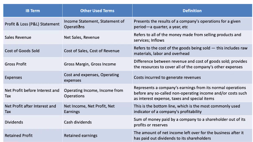
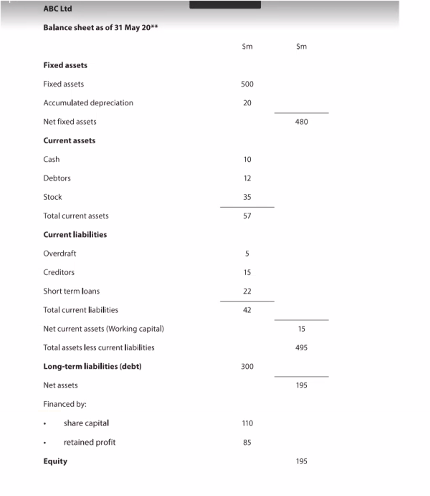

# Finances: Appropriation account

## Dividends
 - the amount of net profit after interest and tax that is distributed to the owners or shareholders of the company.

## Retained profit
- how much is reinvested in the company

## Structure

>Sales Revenue
> 
>Costs of Goods Sold
> 
>**Gross Profit**
> 
>Less Expenses
> 
>Net profit before interest and tax
> 
>less interest
> 
>net profit before tax
> 
>less tax 
> 
>**Net profit after interest and tax.**
>
> Dividends (percentage)
> 
> Retained Profit

> **FOCUS ON NET PROFIT BEFRE INTEREST AND TAX (HOW WELL A COMPANY IS OPERATING)**
> 
> **GROSS PROFIT SHOWS THAT YOU THAT A COMAPANY CAN COVER IMMEDIATE COSTS**
> 
> **NET PROFIT AFTER TAX IS SEEING HOW A COMPANY HANDLES DEBT**
> 
> **PROFITABILITY IS A SIGN OF PERFORMANCE**

# Balance Sheets

A balance sheet is a financial statement reports a companies assets liabilities and shareholders equity at a specific point in time, and provides a basis of computing rates of return and evaluating its capital structure. It is a financial statement that provides a snapshot of **what a company owns and owes**, as well as the amount invested by shareholders.

## Formula
The balance sheet adhered to the following accounting equation, where assets on once side and liabilities plus shareholders equity on the other

$$Assets = Liabilities + ShareholdersEquity$$

This formula is intuitive: a company has to pay for all the things it owns (assets) by either borrowing money (taking on liabilities) or taking it from investors (issuing shareholders' equity).

## What's on the balance sheet?

Tells you what you own and what you owe.

### Assets

 - Items of monetary value that are owned by a business e.g. cash, stocks and buildings
 - To purchase assets forms need different sources of finance
 - Assets can be classified as a fixed assets or current assets
	 - Fixed assets: lasts for more than 12 months form the balance sheet date
	 - Current assets: refers to cash or liquid assets that are likely to be turned into cash within 12 months of the balance sheet date
		 - **Cash**
		 - **Debtors**
		 - **Stocks** (Inventory)
 - An asset belongs to a business but this doesn't mean that it has been paid for

### Liabilities

 - A liability is a legal obligation of a business to repay its lenders or suppliers at a later data, i.e. the amount of money owed by the business
 - Two main classifications
	 - Long-term liabilities
		 - Due to be repaid after 12 months (long-term borrowing such as mortgages and bank loans)
	 - Current liabilities
		 - debts that must be settled withing 12 months
	 - The value of a firms net assets is therefore the total assets minus its liabilities
		 - $$NetAssets = TotalAssets - Total Liabilities$$

### Equity
 - The value of a business belonging to the owners
 - Two main sections:
	 - Share capital
		 - the amount of money raised through the sale of shares. This is the value raised when the shares were first sold, rather than their current market value
	 - Retained Profit
		 - the amount of net profit after interest. Tax and dividends have been paid. It is reinvested in the business for its own use.

