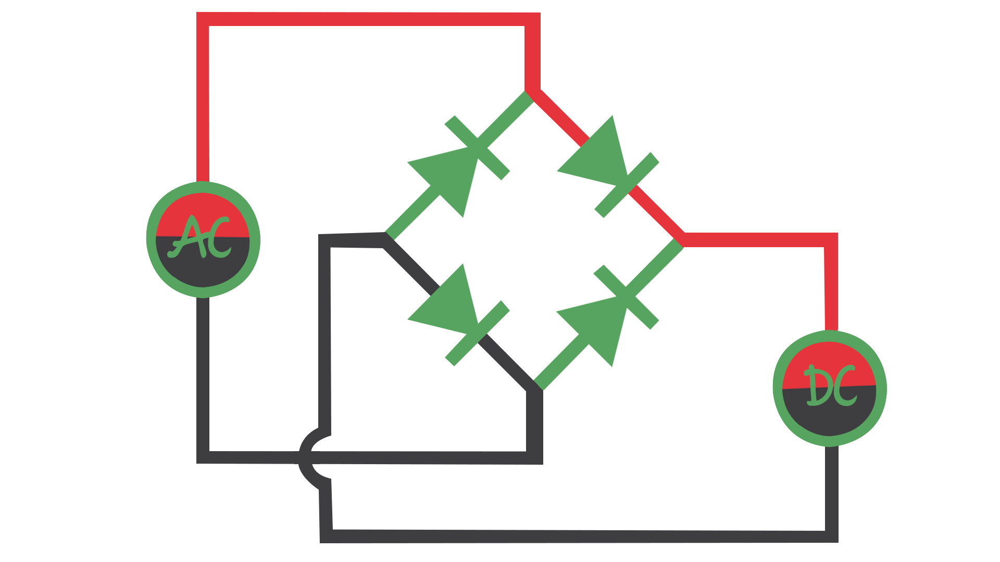
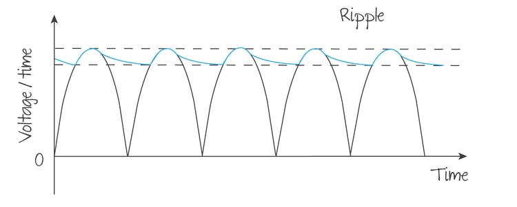

# Electricity Production 

## Generating Electricity

$$\epsilon = N \frac{d \Phi}{dt}$$

$$\epsilon = N \frac{d \times BA cos\theta}{dt}$$

$$\epsilon = NBA \frac{d \times cos\theta}{dt}$$

$$\epsilon = NBA \frac{d \times cos\omega t}{dt}$$
Differentiating 

$$\epsilon = -\omega NBA \times sin(\omega t)$$

So its just a sine wave

## Average Power

$$E = IVt$$

Peak power is $I^{2}_{0}R$ Where $I_{0}$ is the peak current. The peak power is produced when the potential difference and the induced current are also at a maximum

$$P_{max} = I_{0}V_{0}$$

The area under the curve of a sine wave is 1/2 of the actual area

So for A.C. power

$$P_{Average} = \frac{1}{2}I_0V_0 = \frac{1}{2}I_{0}^{2}R$$

So 

$$P_{average} = I_{average}^2R$$
$$\frac{1}{2}I_{0}^{2}R = I_{average}^2R$$

And therefore 

$$\sqrt{\frac{1}{2}I^{2}_{0}} = I_{average}$$

Root mean square 
$$I_{rms} = \frac{I_0}{\sqrt{2}}$$

and the same is true for voltage

$$V_{rms} = \frac{V_0}{\sqrt{2}}$$

And therefore

$$Resistance = \frac{V_0}{I_0} = \frac{V_{rms}}{I_{rms}}$$

## Transformers

Transformers have Primary (**P**) and Secondary (**S**) Coils

There is no such thing as free energy and therefore 

$$V_P I_P=V_S I_S$$

$$\frac{\epsilon_p}{\epsilon_S}=\frac{N_p}{N_s} = \frac{I_S}{I_P}$$

Step up transformers are transformers that have more secondary coil turns, whereas step down 

>#### Definition
>
>An **ideal transformer** is one that has zero losses and is 100% efficient.
>
>Unless the question specifically states otherwise, you will always be dealing with ideal transformers in exam questions.

### Why does a higher voltage help?

Imagine looking inside a long-distance electricity cable. As electricity is transmitted there are electrons moving past metal ions. Sometimes, the electrons collide with the ions and their kinetic energy is converted into heat. The longer the cable, the more chance this has of happening, and so transmitting electricity over long distances would mean big losses.

## Creating D.C.

### Half-wave rectification

The most simple way to change AC to DC is to use a circuit with a diode. A diode is an electrical component that only allows current to flow in one direction. In other words, when it is in an AC circuit it 'removes' the negative portion of the AC,Using a diode in this way is called **half-wave rectification** because it produces half of the AC wave pattern. 

### Full-wave rectification

Using a simple diode removes half of the wave straight away. Even if the whole system is 100% efficient there is a maximum possible output power of 50% of the input. After so much effort went into the generation and transmission of that electricity, this is an enormous waste.

A full-wave rectifier uses a more complex series of diodes (called a **diode bridge**) to reverse the negative parts of the AC to give a series of positive peaks. The diode configuration is shown in the animation in **Figure 4.** Notice that the DC output always has the positive and the negatives on the same side even though the input is AC.

> #### Definition
>
>**Full-wave rectification** is the process where the whole of the AC wave is converted into a pulsating, positive DC wave.

### Adding capacitors

We can achieve a much smoother DC output using **capacitors**. We will study capacitors in detail in the next subtopic, but in very simple terms they can be thought of as temporary batteries. If a potential is applied across their terminals capacitors will store charge; this charge is released if they are subsequently connected to a load such as a resistor.

